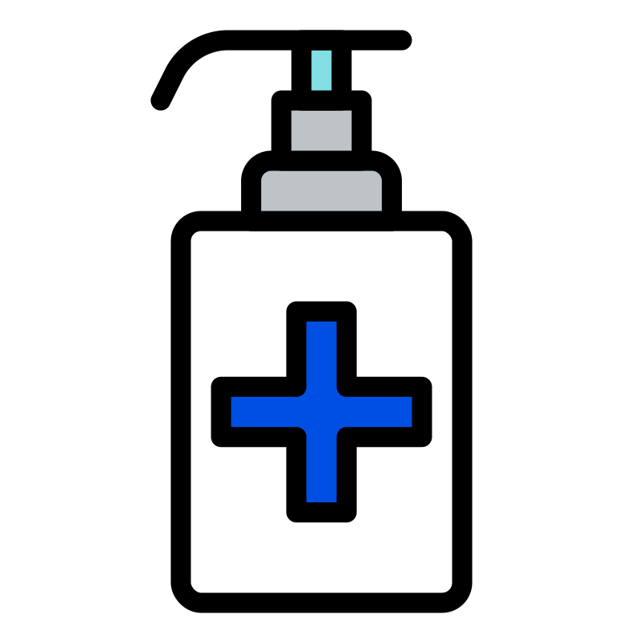

<div align="center"> 
  
  <h1> VanillaTS - Dashboard Covid-19 - Faculdade XPe </h1>
</div>

## 🧑🏻‍💻Desenvolvido por

@[AdaoBJr](https://github.com/AdaoBJr/)
<br>

---

## 💡 Sobre o Projeto

Este Projeto foi desenvolvido para uso com Vanilla e TypeScript.
Sua função é implementar a fixação dos estudos da pós graduação do curso de Desenvolvedor FullStack da Xpe.

## 🛠 Tecnologias Usadas

- Vanilla
- TypeScript
- Vite
- Axios
- Chart.js
- Dayjs
- Tailwind

## 🧙‍♂️ Como Iniciar o Projeto

Primeiro faça a clonagem do projeto em algum diretorio do seu computador:

```bash
> cd ~
> cd Documents/Desktop
> git clone git@github.com:AdaoBJr/dashboard-covid-xpe.git dashboard-covid-xpe
```

Depois disso instale as dependências:

```bash
> cd dashboard-covid-xpe
> yarn ou npm install
```

Por fim, rode o seguinte script para iniciar o projeto:

```bash
> yarn server
> yarn dev
```

O projeto vai iniciar em http://localhost:3000. - vanillaTS
